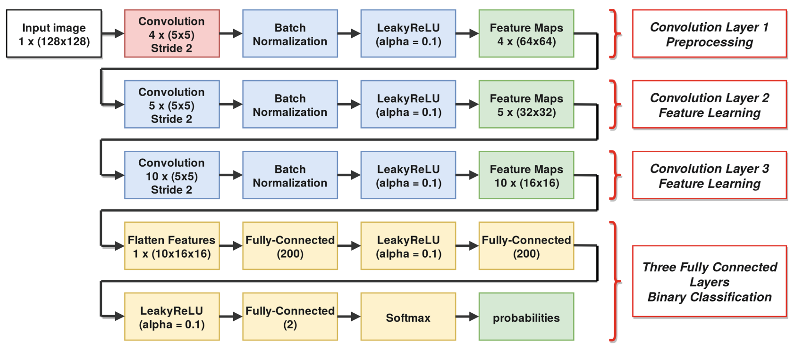

# An Improved CNN Steganalysis Architecture Based on “Catalyst Kernels” and Transfer Learning

## About the reference

This code is an implementation of the mentioned paper above in the title. You can also find that paper [here](https://link.springer.com/chapter/10.1007/978-3-319-97749-2_9).

The proposed model structure is as below.


## How to run the code

You can run the code as below:

```bash
python main.py \
--ctrp <cover train path> \
--ctep <cover test path> \
--strp <stego train path> \
--step <stego test path> \
--nc <number of classes> \
--ne <number of epochs> \
--bs <batch size> \
--assert_model <if you want to assert your model> \
--shuffle <if you want to shuffle your data> \
-v <to verbose the output of training> \
--op <output path for saved models>
```

Also you can run `python main.py -h` to get more help

There is also a Colab code available [here](https://colab.research.google.com/drive/1u1cLrQobCv3tKvUk_Fx8z9BHoIAMZrtg?usp=sharing). For the datasets you can email me (s.emad.helmi@gmail.com) to share them with you.

## Availabe datasets

### BOSSbase_1.01

- Embedded with `wow` algorithm and embedding rates: `0.8`, `0.4`, `0.2` and `0.1`
- Embedded with `s-uniward` algorithm and embedding rates: `0.8`, `0.4`, `0.2` and `0.1`

## Results

This is my first run result on **128*128 BossBase** images with **0.8 wow embedding**

