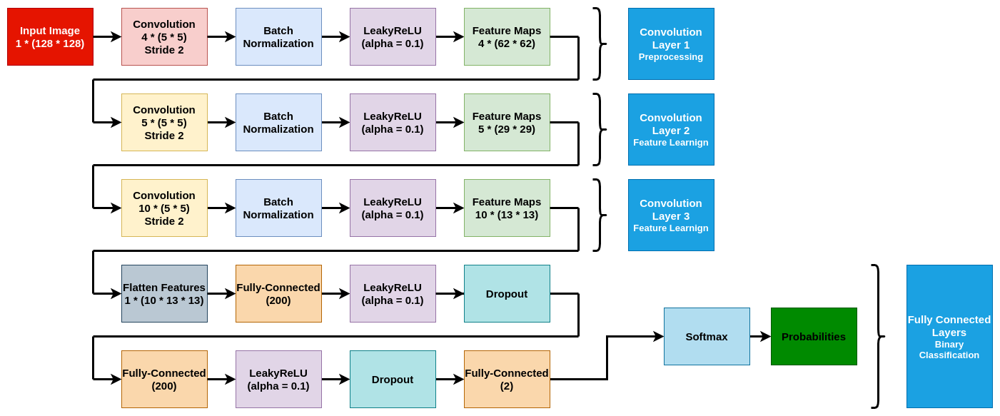
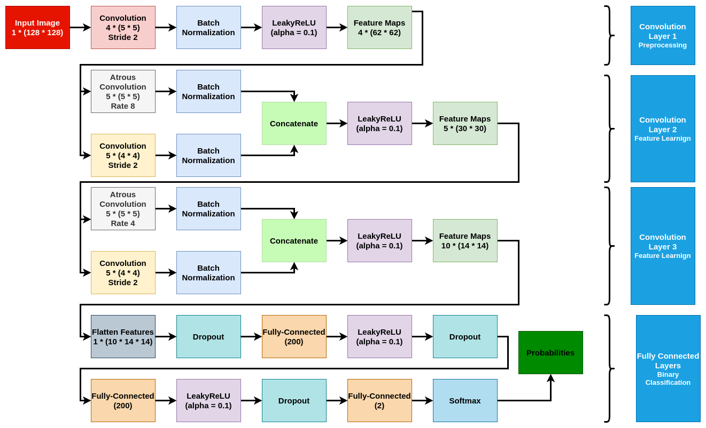

# An Improved CNN Steganalysis Architecture Based on “Catalyst Kernels” and Transfer Learning

## About the reference

This code is an implementation of the mentioned paper above in the title. You can also find that paper [here](https://link.springer.com/chapter/10.1007/978-3-319-97749-2_9).

The proposed model structure based on versions are as below:

### Model V1.0.0

This is the basic model represented in the main paper.


### Model V1.1.0

This is a forked version of the main model. In this model we add `Dropout` before some nodes.


### Model V1.2.0

This is a forked version of the main model. In this model we add `Dropout` before all dense layers.


### Model V1.3.0

This is a forked version of the main model. In this model we replace `Atrous Conv` In 2nd and 3rd layers with normal conv layers.


### Model V1.4.0

This is a forked version of the main model. In this model we add `Atrous Conv` In 2nd and 3rd conv layers parallel with the normal conv layers.


### Custom model

If you want to check your custom model, just follow these steps :)

1. in the `models` folder make a `.py` file for your model in this format:

    ```python
    # Your imports goes here


    def build_model(input_shape):
        """
        Its better to write comments for each function you write :)

        Parameters:
            input_shape (tuple): The input shape of the model. It should be in the form of (1, ..., ...).

        Returns:
            TYPE OF RETURNED MODEL: The built model.
        """
        # Your model code goes here
        # define a model variable
        # return model
    ```

2. In `utils.py` file in `from models import...` line add your `.py` file you created in `step 1`

3. In `utils.py` file in `get_model` function add another `elif` statement which checks your model version like this:

    ```python
    elif version == "YOUR MODEL VERSION":
        # return the model which you import in step 2
    ```

## How to run the code

You can run the code as below:

```bash
python main.py \
--ctrp <cover train path> \
--ctep <cover test path> \
--strp <stego train path> \
--step <stego test path> \
--nc <number of classes> \
--ne <number of epochs> \
--bs <batch size> \
--assert_model <if you want to assert your model> \
--shuffle <if you want to shuffle your data> \
--op <output path for saved models>
-v <Verbosity level> \
```

Also you can run `python main.py -h` to get more help

There is also a Colab code available [here](https://colab.research.google.com/drive/1u1cLrQobCv3tKvUk_Fx8z9BHoIAMZrtg?usp=sharing). For the datasets you can email me (s.emad.helmi@gmail.com) to share them with you.

## Availabe datasets

### BOSSbase_1.01

You can download the raw dataset from this [link](http://agents.fel.cvut.cz/stegodata/BossBase-1.01-cover.tar.bz2).

- Embedded with `wow` algorithm and embedding rates: `0.8`, `0.4`, `0.2` and `0.1`
- Embedded with `s-uniward` algorithm and embedding rates: `0.8`, `0.4`, `0.2` and `0.1`

### BOWS2OrigEp3

You can download the raw dataset from this [link](http://bows2.ec-lille.fr/BOWS2OrigEp3.tgz).

- Embedded with `wow` algorithm and embedding rates: `0.8`, `0.4`, `0.2` and `0.1`
- Embedded with `s-uniward` algorithm and embedding rates: `0.8`, `0.4`, `0.2` and `0.1`

## Results

This is my first run result on **128*128 BossBase** images with **0.8 wow embedding**


I am currently training with multiple datasets and mixture of thoese datasets and you and see their results [here](https://docs.google.com/spreadsheets/d/1-GqSu9oU1fU2ZA8MORzvkJc5fTDhdBwhvfcCna6xJQU/edit#gid=660197613).
